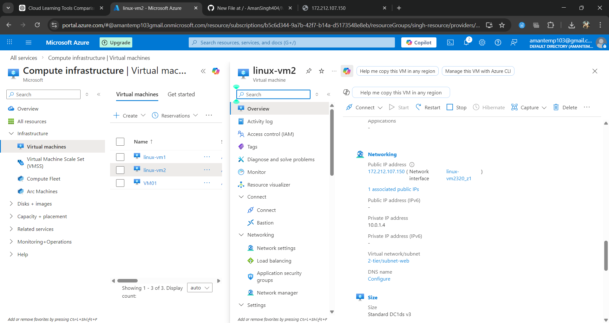
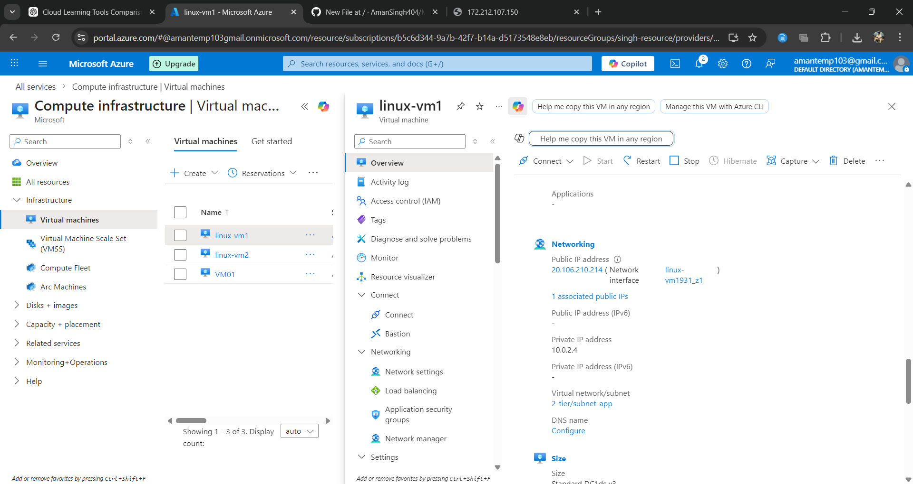
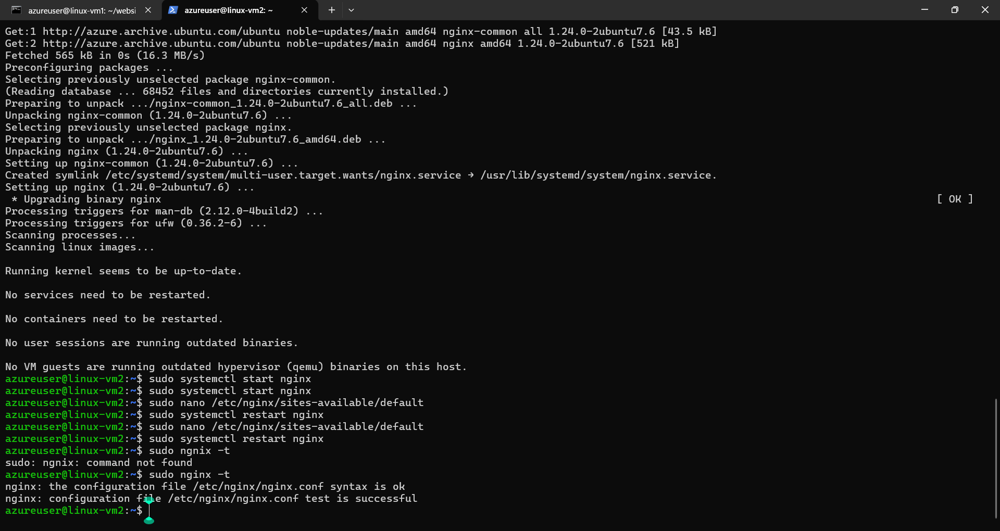
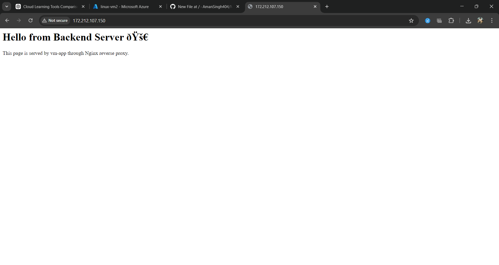

# Day 3 – Two Tier Architecture with Nginx Reverse Proxy

## Objective

To create a two-tier cloud architecture where a web server forwards requests to a backend application server.

## Architecture

User → VM-Web (Nginx) → VM-App (Python HTTP Server)

Both servers communicate using private IP addresses inside the Azure Virtual Network.

## Steps Performed

1. Created two virtual machines in different subnets.
2. Installed Python HTTP server on VM-App.
3. Installed Nginx on VM-Web.
4. Configured Nginx as a reverse proxy.
5. Forwarded requests from VM-Web to VM-App using private IP.

## Commands Used

python3 -m http.server 8000

sudo apt install nginx

sudo systemctl restart nginx

## Result

The web server successfully forwarded requests to the application server through the internal Azure network.

## Architecture Diagram

## VM Web Public IP

## VM App Private IP

## Nginx Configuration

## Browser Output

## Key Learning

Reverse proxy architecture improves security and allows backend servers to remain private.

