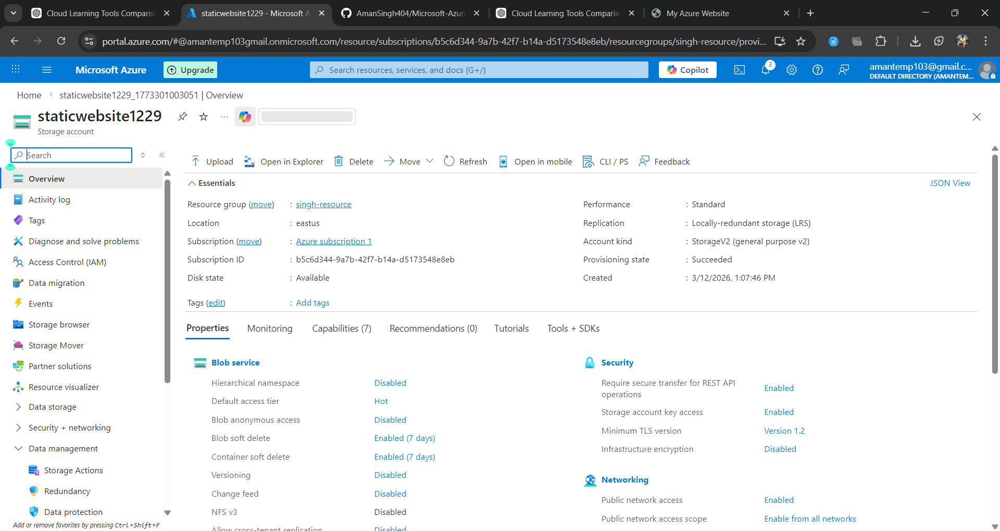
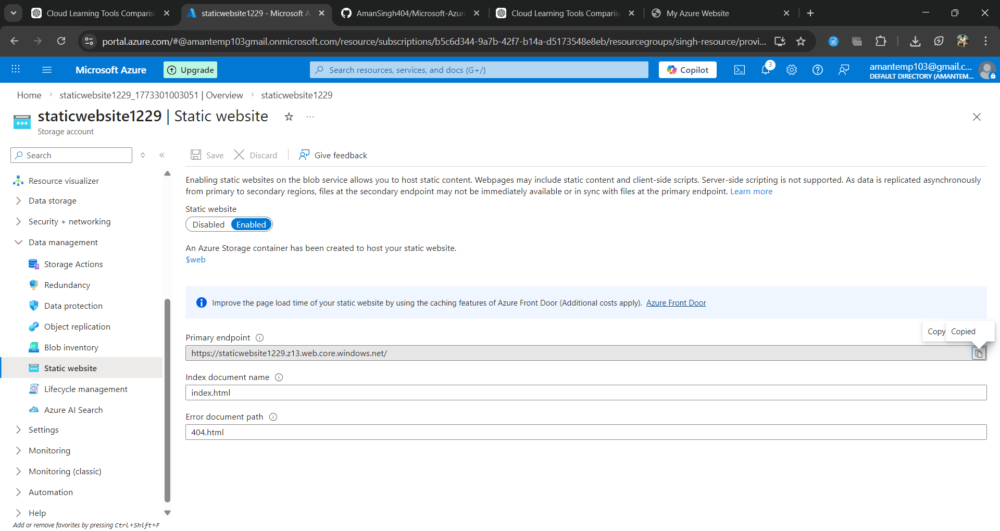

# Day 7 – Static Website Hosting on Azure Storage

## Objective
Host a static website using Azure Storage.

## Steps

1. Created a storage account.
2. Enabled static website hosting.
3. Uploaded HTML files to $web container.
4. Accessed the public website URL.

## Architecture

User → Internet → Azure Storage → Static Website

## Result

Website successfully hosted on Azure cloud storage.

## Key Learning

Static website hosting allows fast, scalable, and low-cost website deployment without managing servers.

#Storage Account Overview:

#Static Website Confiiguration

#Website Output

